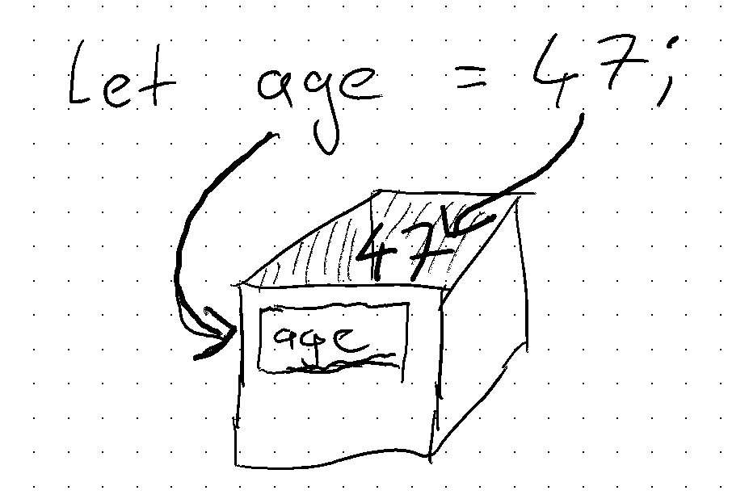

# Lesson 1 - Variables & Operators

## What is a variable

A variable is a container to store information in, so that we can use it in our program.
It can created with the `let` instruction.

A variable has:

- a name
- a value

Example:

```JavaScript
let age = 47;
```

**Name**: age<br>
**Value**: 47



## Variables have "data types"

In JavaScript, there are two kind of types: Primitives and Complex types. We have only looked at primitives. Don't worry about the complex types for a while.

The primitives we looked at are:

- Numbers
- Strings
- Booleans

### Numbers

JavaScript, per se, does not make a difference between whole numbers (also called integers) and fractional numbers (also called floating point numbers). This will sometimes be important. A floating point is expressed with a . as the decimal separator (which is different from the usual german representation which uses the comma). You create numbers by just writing them out: `let number = 12.35`.

As we've seen, floating point numbers in JavaScript are not arbitrarily precise. It is relatively simple to get confusing rounding errors:

```JavaScript
let a = 1.12;
console.log(a * 100);
// Results in: 112.00000000000001
```

This is due to the way the computer stores floating point numbers in memory and is nothing to worry about. We'll see later on how we can work around these limitations.

### Strings

Strings are a "String of characters". You can create strings by enclosing text with quotes: `let string = "hello"`

### Booleans

Very often in computing we need to know if something is true or false - If an answer to a question is yes or no. That's why most programming languages have a separate data type called a boolean.

Booleans are written as `true` and `false`.

## Naming variables

- As long as needed (So that the meaning is absolutely clear)
- As short as possible (So that it is easy to read and type)
- Should start with a lowercase Character (`customerName`, not `CustomerName`)
- If composed of several words, use `CamelCase` to separate words.

## Operators

JavaScript can math. We talked about the following operators:

- `+` - Addition (or concatenation for strings, see below)
- `-` - Subtraction
- `*` - Multiplication
- `/` - Division
- `%` - Modulo (This returns the division remainder)

Quick example:

```JavaScript
let money = 100;
let conversionRate = 1.25;
let result = money * conversionRate;
let reverseResult = money / conversionRate;
```

### The pesky `+` and automatic type conversion

The plus sign is a so-called "overloaded" operator. It means it does several things depending on the types:

- When both sides are numbers, the result is going to be a number with the value of both numbers added (`2 + 2 => 4`)
- When both sides are strings, the result is both strings concatenated together (`"a" + "b" => "ab"`)
- When any of the sides is a string and the other one is a number, the number gets converted into a string and the two are concatenated (`"2" + 3 => "23"`)

This is important to keep in mind and a subtle source of errors and bugs in your software. If you know that you want to add two numbers but you are not sure what the input is, you need to convert it manually by using `Number()`.

### Maths and precendence rules

For all the operators we looked at, precendence rules follow normal math rules: In german we say "Punkt- vor Strichrechnung" meaning that multiplication and division have precendence over addition and subtraction.

In the same way as with math, you can (and need to) use parentheses to override these rules.

```JavaScript
let result = (a + b) * c; // make sure we do the addition first
```

## Input / Output

In Replit, we can use `prompt()` to ask the user for input.

```JavaScript
let age = prompt("What is your age");
let name = prompt("What is your name");
```

One thing that it is important to remember is that prompt will **always** return strings, regardless of what exactly the user typed in. So if you expect a number, for example because you want to do some calculations with it, you'll need to use `Number()` to turn it into a number.

We also can use `console.log()` to output something to the user. It will color different data types in different colors and takes as many arguments as you like.

```JavaScript
console.log("age", age, "name" name);
```

### Functions

Both `prompt` and `console.log` are so-called functions. We will learn how to write our own functions later on - For now you only need to know that functions are ways to encapsulate a piece of code and that they take arguments (Much as a mathematical function may take arguments) and may (or may not) return a value. (`prompt` does, `console.log` does not)

- Arguments are separated by commas. Each argument may be a full JavaScript expression, for example an addition or a string concatenation.
- Generally functions just return one value. Good enough for now.

## Comments

You can add comments to your code. they are ignored by the JavaScript interpreter and can help you to document your code.

There are two types of comments:

```JavaScript
/* A block comment starts with slash-asterisk and
** can span many lines. It is good for longer remarks
** and documentation. It ends with asterisk-slash.
** (The leading ** here are just for looks)
*/

// A line comment turns the rest of the line into a comment but only that line
let age = 47; // it is good to explain a single line of code.
```
