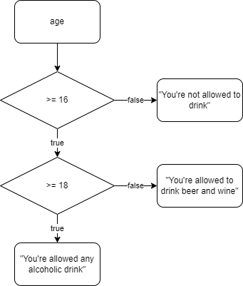

## Homework Lesson 2

Here's a version of the flowchart we used to implement our two stage drinking age checker.



You can find the code in [if_intro.js](../code/lesson_2/if_intro.js)

---

As it is often the case, this is not the only solution to this.

For example, we could test for the higher age first, so start like this:

```JavaScript
if (age >= 18) {
  //...
} //...
```

**Exercise 1: Try to draw a new flowchart that does this. As a bonus, try to write the whole code for it**

Start with drawing on paper. There are a lot of flowchart applications (I used the VSCode extension from [drawio](https://www.diagrams.net) to create these) out there but drawing on paper is the quickest and easiest.

---

One other thing we could do is just to reverse all the conditions and test for the "negative". Here's a flowchart of how that could look like:


The difference in the flowchart is subtle, but if you'll try to implement this in your code, you will find that it reshuffles all of the if statements quite a bit.

**Excersise 2: Implement the second flow chart in an alternative version of the existing code**

As we'll see later, it often makes sense to test for the "negative" condition instead of the positive as it often allows us to simplify things.
