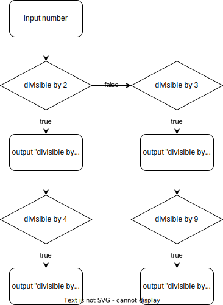

# Homework Lesson 3

## E1: yes, oui, Ja, да, no, non, nein, нет

Often, when software wants to do something scary like deleting a bunch of files, or starting a long installation procedure, it will ask you if it is supposed to succeed. Similar to:

```
Installation of Florpbus 3000 will take approximately 24 hours. Should I continue (yes/no)?
```

I want you to build a particularly userfriendly version of this that is able to take the answer in multiple languages, so that the user can answer that question in their own language. Choose your 3 favourite languages. The start of the program should look like this:

```JavaScript
let prompt = require('prompt-sync')();

let answer = prompt("Continue with installation (yes/no)? ");

```

The program should output (`console.log`) either "Will continue with installation now" or "Installation stopped".

You only need to test for either the positive or the negative answer, not both, so the solution to this is a single `if/else`.

A couple of questions to think about before implementing:

- What boolean operator can help here?
- Does it make more sense to test against Yes or against No?

## E2: ATM+

Let's take our ATM (See [atm.js](../code/lesson_3/atm.js) for the canonical example if you need to) and make it possible to not only withdraw but also deposit money.

We can ask the user (before we ask for the amount) like this:

```JavaScript
let withdrawOrDeposit = prompt("Withdraw or Deposit (w/d)?")
```

Then we can branch out into two separate branches in our code depending on if the user entered `w` or `d`. (Only test for one of these and then assume, if the user has not entered `w`, they entered `d`, so that you can use a simple `if/else`)

Obviously, when the user deposits something, you only need to output the new balance and don't need to test for enough funds, so the new branch should be easier to program.

<details>
<summary>To see some Pseudocode for help unfold this</summary>

```
withdrawOrDeposit = prompt("w/d")
if (widthdrawOrDeposit == 'w')
  withdraw = prompt("Amount")
  if (withdraw < balance)
    newBalance = balance - withdraw
    console.log(newBalance)
  else
    console.log("insufficient funds")
else
  deposit = prompt("Amount")
  newBalance = balance + deposit
  console.log(newBalance)
```

</details>

## E3: A whole lot of ifs

Consider the following flowchart.



Try to build code for this.

A number is divisible by another number if the modulo is zero. For example, to test if a number is divisible by 2:

```JavaScript

let number = 5;
let divisibleByTwo = number % 2 === 0; // false
```

To make life for yourself easier, try to address one of the branches (best try the left one) first.

To clarify: "input number" means that the user should be prompted for a number. "output 'divisible by 4'" could mean `console.log(number + " is divisible by 4")`
